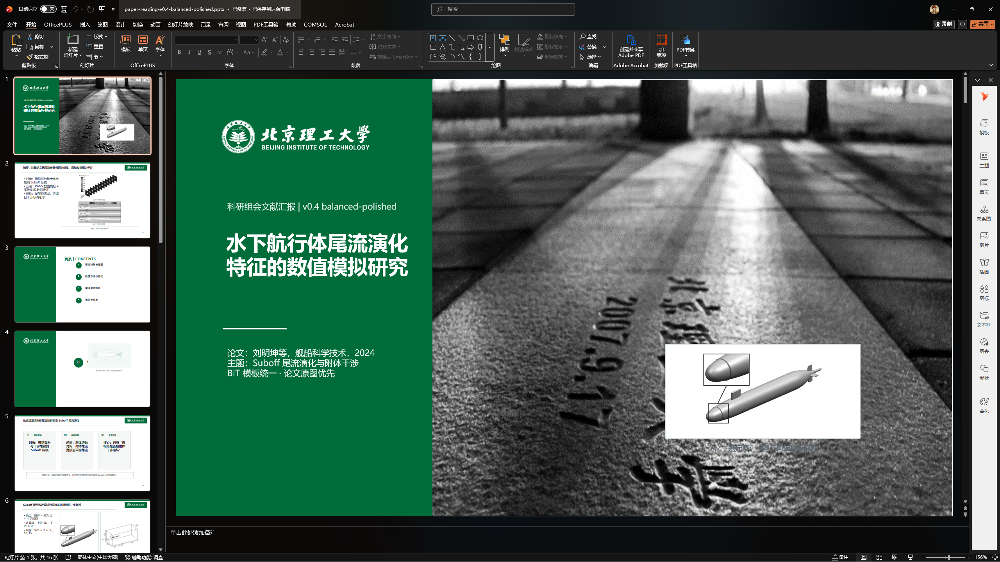
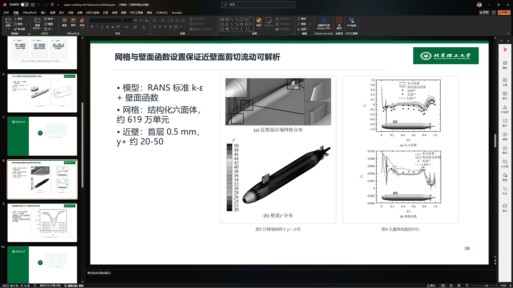
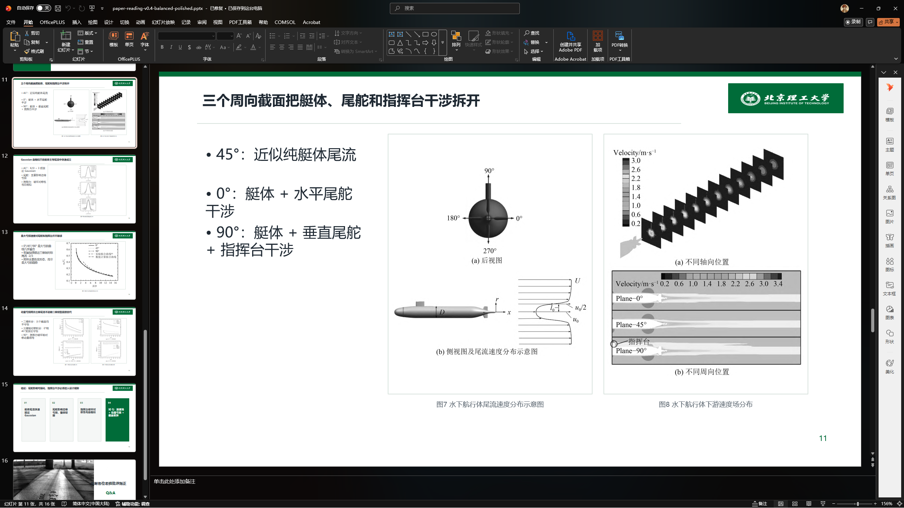

````md
# ppt-deck-builder-skill

A reusable AI-agent skill for generating polished academic PowerPoint decks, optimized for paper-reading reports, research group meetings, thesis defenses, CFD/COMSOL result presentations, and BIT-style academic layouts.

This repository provides:

- a structured slide-generation workflow in `SKILL.md`
- a custom academic PPT template workflow
- example preview images
- example generated deck output

> Note: This is not an official Beijing Institute of Technology template package.

---

# What It Does

- Builds academic PPT outlines, slide scripts, speaker notes, and full deck plans.
- Supports paper-reading reports, research group meeting slides, thesis defense decks, CFD/COMSOL result presentations, and engineering project presentations.
- Uses a template-first workflow when a PPT template is provided.
- Supports BIT-style academic presentation layouts, including green/white styling, cover pages, contents pages, section dividers, figure-heavy result pages, and conclusion pages.
- Prioritizes original paper figures for scientific evidence slides.
- Separates formal slide content from speaker notes.
- Checks Chinese text readability and common encoding failures such as `????`.

---

# Example Output

Example generated deck:

- `examples/paper-reading-v0.4-balanced-polished.pptx`

Example input paper:

- `examples/liu2024-underwater-wake-paper.pdf`

Preview slides:

## Example Cover Slide



## Example Methodology Slide



## Example Analysis Slide



The example deck is based on the following paper:

> 刘明坤, 徐辰, 曾荆州, 等. 水下航行体尾流演化特征的数值模拟研究[J]. 舰船科学技术, 2024, 46(04): 27-34.

The example is used only to demonstrate the slide-generation workflow, academic layout style, and figure-first presentation structure.

---

# Repository Structure

```text
ppt-deck-builder-skill/
├── README.md
├── SKILL.md
├── templates/
│   └── README.md
├── examples/
│   ├── README.md
│   ├── example1.png
│   ├── example2.png
│   ├── example3.png
│   ├── paper-reading-v0.4-balanced-polished.pptx
│   └── liu2024-underwater-wake-paper.pdf
└── .gitignore
````

---

# Included Template

This repository may include a custom academic PPT template created by the repository author.

The included template is intended for AI-assisted academic presentation generation, paper-reading reports, research group meetings, and educational use.

The template is not an official Beijing Institute of Technology template and does not claim institutional endorsement.

---

# Important Scope Note

“BIT-style” means a presentation layout direction inspired by Beijing Institute of Technology-style academic presentations.

This skill does not redistribute official Beijing Institute of Technology templates, official school logos, seal source files, or other restricted visual assets.

Users should provide their own authorized templates, papers, figures, and source materials when generating institution-specific decks.

---

# Recommended Install for Codex

Copy this repository folder into your Codex skills directory:

```powershell
$target = "$env:USERPROFILE\.codex\skills\ppt-deck-builder"
New-Item -ItemType Directory -Force -Path $target
Copy-Item -Recurse -Force .\SKILL.md $target
```

Then restart Codex or refresh skills so the `ppt-deck-builder` skill can be discovered.

---

# Use with Claude Code / Cursor / Other Agents

This skill is not limited to Codex.

It is essentially a Markdown-based workflow / SOP / prompt instruction file. Most AI coding agents that can read repository files can use it as a reference.

For example:

```text
Read SKILL.md and follow the ppt-deck-builder workflow.
Use the PPT template workflow in templates/.
Generate an academic paper-reading presentation from the provided paper.
Prioritize original paper figures and keep the layout clean.
```

Compatible in principle with:

* Codex
* Claude Code
* Cursor
* other Markdown-driven AI coding agents

Actual output quality depends on the agent’s file-reading, PowerPoint-generation, and document-analysis capabilities.

---

# Example Prompts

```text
Use ppt-deck-builder to create a paper-reading PPT outline from the current PDF.
```

```text
Use ppt-deck-builder to generate a BIT-style academic group meeting deck. Use original paper figures for evidence slides and keep AI images only for conceptual visuals.
```

```text
Use ppt-deck-builder to review this deck for title consistency, body text size, excessive whitespace, figure readability, source tracking, and Chinese garbling.
```

```text
Use ppt-deck-builder with the template workflow to generate a 15-page paper-reading report PPT from this paper.
```

---

# Public Repository Hygiene

Do not commit:

* private papers, thesis drafts, or unpublished research material
* unauthorized copyrighted PDFs
* official university templates or logo source files
* extracted paper figures unless redistribution is authorized
* `.env` files, API keys, tokens, or local cache files

Generated `.pptx` and preview images may be included only when you have the right to share the source materials used inside them.

---

# License

Please check the repository license before reuse.

If no license is provided, all rights are reserved by default.

```
```
